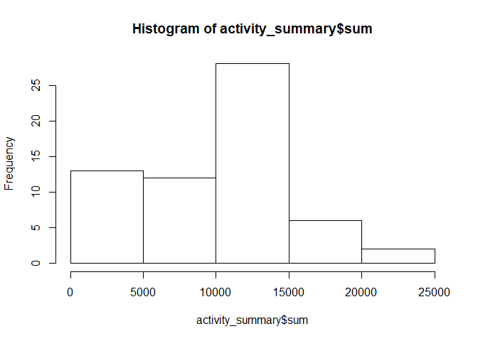
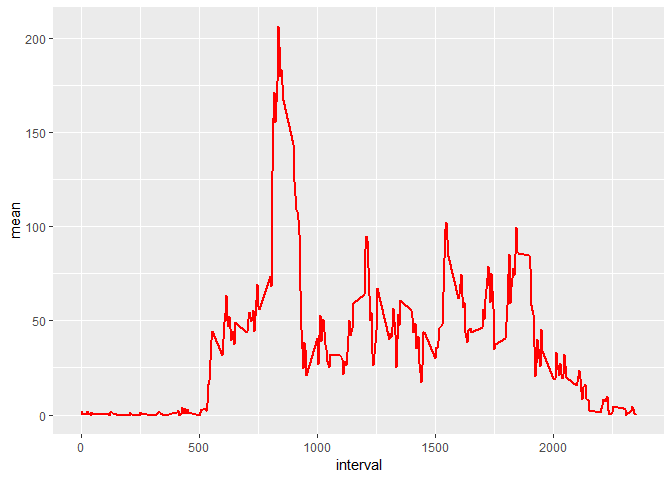
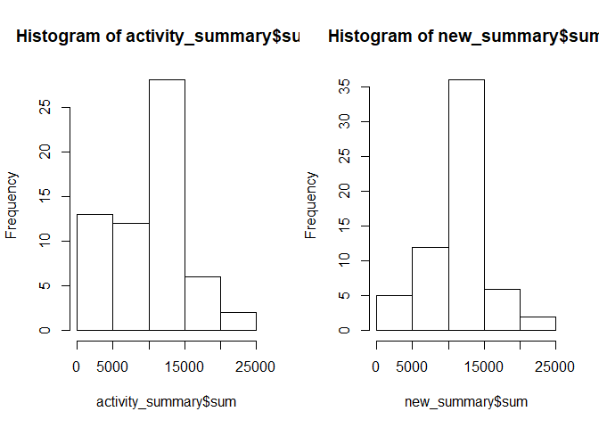
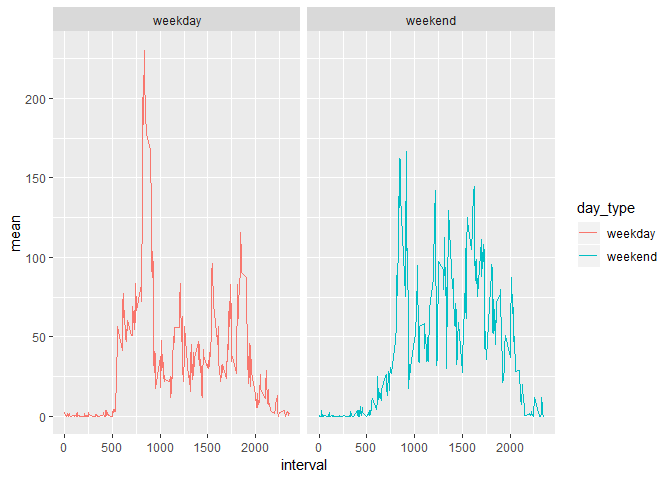

```r
#loading packages
library(dplyr)
library(lubridate)
library(ggplot2)

#set wd
setwd("C:/Users/theGameTrader/Documents/R/coursera/reproducible research")
#reading in data
activity= read.csv("./activity.csv")
#formatting date to be a date variable instead of factor
activity$date = ymd(activity$date) 
```

```r
#analysis to check data type
head(activity)
```

```
##   steps       date interval
## 1    NA 2012-10-01        0
## 2    NA 2012-10-01        5
## 3    NA 2012-10-01       10
## 4    NA 2012-10-01       15
## 5    NA 2012-10-01       20
## 6    NA 2012-10-01       25
```

```r
str(activity)
```

```
## 'data.frame':	17568 obs. of  3 variables:
##  $ steps   : int  NA NA NA NA NA NA NA NA NA NA ...
##  $ date    : Date, format: "2012-10-01" "2012-10-01" ...
##  $ interval: int  0 5 10 15 20 25 30 35 40 45 ...
```


```r
#calculating sum, mean and median number of steps
activity_summary =  activity %>%
                    group_by(date) %>%
                    summarise(sum=sum(steps, na.rm=TRUE), mean=mean(steps, na.rm=TRUE), median = median(steps, na.rm=TRUE) )

#histogram
hist(activity_summary$sum)
```

<!-- -->


```r
#calulating mean number of steps by time interval
activity_summary2 = activity %>%
                    group_by(interval) %>%
                    summarise(mean=mean(steps, na.rm=TRUE))

#time series plot
ggplot(data=activity_summary2, aes(x=interval, y=mean)) +
  geom_line(color ="red", size=1)
```

<!-- -->


```r
#maximium 
max(activity_summary2$mean)
```

```
## [1] 206.1698
```

```r
activity_summary2[order(-activity_summary2$mean), ]
```

```
## # A tibble: 288 x 2
##    interval  mean
##       <int> <dbl>
##  1      835  206.
##  2      840  196.
##  3      850  183.
##  4      845  180.
##  5      830  177.
##  6      820  171.
##  7      855  167.
##  8      815  158.
##  9      825  155.
## 10      900  143.
## # ... with 278 more rows
```

```r
#retrieving max value
activity_summary2[which.max(activity_summary2$mean),]
```

```
## # A tibble: 1 x 2
##   interval  mean
##      <int> <dbl>
## 1      835  206.
```

```r
#calculating NAs by column
activity %>%
  summarise_all(funs(sum(is.na(.))))
```

```
##   steps date interval
## 1  2304    0        0
```

```r
#double check
sum(is.na(activity))
```

```
## [1] 2304
```

```r
#replace missing with mean by interval
#replace(variable to replace, list of things to replace, value with which to replace with)
activity2= activity %>% group_by(interval) %>% mutate_all(funs(replace(., which(is.na(.)),
                                                             mean(., na.rm=TRUE))))
new_summary = activity2 %>%
              group_by(date) %>%
              summarise(sum=sum(steps, na.rm=TRUE), mean=mean(steps, na.rm=TRUE), median = median(steps, na.rm=TRUE) )

head(activity_summary)
```

```
## # A tibble: 6 x 4
##   date         sum    mean median
##   <date>     <int>   <dbl>  <dbl>
## 1 2012-10-01     0 NaN         NA
## 2 2012-10-02   126   0.438      0
## 3 2012-10-03 11352  39.4        0
## 4 2012-10-04 12116  42.1        0
## 5 2012-10-05 13294  46.2        0
## 6 2012-10-06 15420  53.5        0
```

```r
head(new_summary)
```

```
## # A tibble: 6 x 4
##   date          sum   mean median
##   <date>      <dbl>  <dbl>  <dbl>
## 1 2012-10-01 10766. 37.4     34.1
## 2 2012-10-02   126   0.438    0  
## 3 2012-10-03 11352  39.4      0  
## 4 2012-10-04 12116  42.1      0  
## 5 2012-10-05 13294  46.2      0  
## 6 2012-10-06 15420  53.5      0
```


```r
par(mfrow=c(1,2))

hist(activity_summary$sum)
hist(new_summary$sum)
```

<!-- -->

```r
#Setting weekday/ weekends
activity2$day = weekdays(activity2$date)
activity2$day_type = ifelse(activity2$day %in% c("Saturday","Sunday"), "weekend", "weekday")
#check
activity2 %>% group_by(day_type, day) %>% summarise(n=n())
```

```
## # A tibble: 7 x 3
## # Groups:   day_type [?]
##   day_type day           n
##   <chr>    <chr>     <int>
## 1 weekday  Friday     2592
## 2 weekday  Monday     2592
## 3 weekday  Thursday   2592
## 4 weekday  Tuesday    2592
## 5 weekday  Wednesday  2592
## 6 weekend  Saturday   2304
## 7 weekend  Sunday     2304
```

```r
#weekday summray
split_summary = activity2 %>%
                group_by(interval, day_type) %>%
                summarise(sum=sum(steps, na.rm=TRUE), mean=mean(steps, na.rm=TRUE), median = median(steps, na.rm=TRUE) )
```


```r
par(mfrow=c(2,1))

ggplot(data=split_summary, aes(x=interval, y=mean, group=day_type, colour=day_type)) +
  geom_line() +
  facet_grid(~day_type,scales="free")
```

<!-- -->
